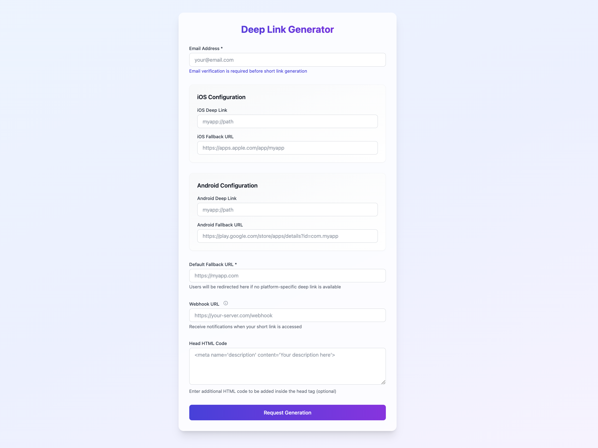

# URL 단축 서비스



## 📝 프로젝트 소개

이 프로젝트는 URL 단축 서비스로, 딥링크와 폴백 URL을 지원합니다. 이메일 인증을 통해 URL을 생성하고, 플랫폼(iOS/Android)별로 다른 리다이렉션을 제공합니다.

### 주요 기능

| 기능 | 설명 |
|------|------|
| 🔗 URL 단축 | 긴 URL을 짧은 형태로 변환 |
| 📱 딥링크 지원 | iOS/Android 앱 딥링크 처리 |
| ✉️ 이메일 인증 | 이메일 인증 후 단축 URL 생성 |
| 🔄 Fallback | 앱 미설치시 대체 URL 제공 |
| 🪝 Webhook | URL 접속자에 대한 알림 기능 |

## 🛠 기술 스택

### 주요 라이브러리

| 라이브러리 | 버전 | 용도 |
|------------|------|------|
| axum | 0.7 | 웹 프레임워크 |
| tokio | 1.0 | 비동기 런타임 |
| rusqlite | 0.32.1 | SQLite 드라이버 |
| lettre | 0.11 | 이메일 발송 |
| serde | 1.0 | JSON 직렬화 |

## 🚀 시작하기

1. 저장소 클론
   ```
   git clone https://github.com/lee-lou2/rust-url-shortener
   ```

2. 환경 변수 설정
    ```
    SERVER_HOST=127.0.0.1
    SERVER_PORT=3000

    EMAIL_ADDRESS=
    EMAIL_USER_NAME=
    EMAIL_PASSWORD=
    EMAIL_HOST=
    EMAIL_PORT=
    ```

3. 실행
   ```
   cargo run
   ```

## 📈 향후 개선 사항

- [ ] 플랫폼별 처리에 대한 확인
- [ ] 이메일 템플릿 개선
- [ ] 관리자 대시보드 추가
- [ ] 통계 기능 구현
- [ ] 테스트 코드 작성
- [ ] Docker 컨테이너화
